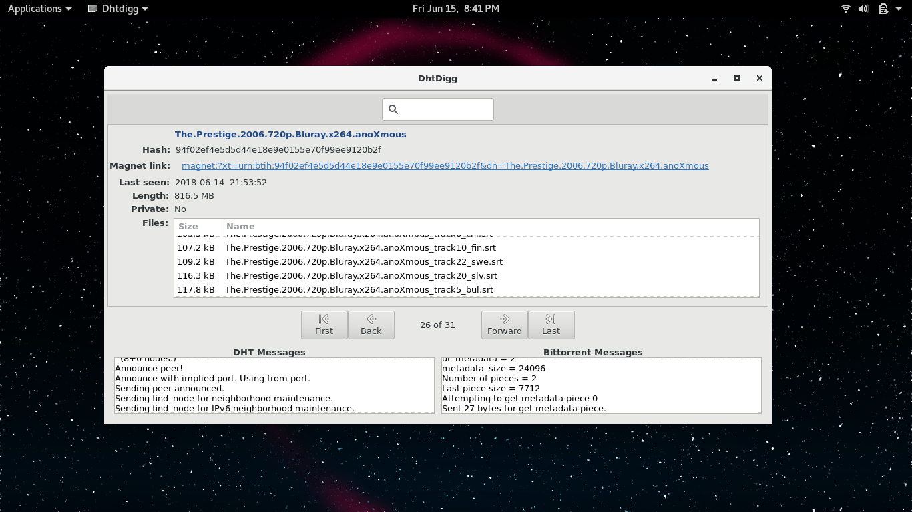

# dhtdigg

dhtdigg uses the work of Juliusz Chroboczek (dht.c & dht.h) to access the
mainline dht network and capture announced peer addresses and thier 
associated info_hashes. Once captured, dhtdigg attempts to create a BT
connection and request the metadata associated with that info_hash. If
successful, the metadata is parsed into a Sqlite database named dhtdigg.db. 
The GUI is a simple database viewer that also has message displays from the 
DHT & Bittorent threads.

WARNING:  The database entries found with this program are UNFILTERED &
          UNCENSORED and may point to copyrighted content. Click on magnet
          links at your own risk.

NOTE:     dhtdigg does not download or share any of the bittorrent pieces
          containing the content being shared via bittorent. dhtdigg only
          downloads the metadata and then disconnects.

Screenshot

TODO:
 - Currently seach does nothing. 
 - Currently not capturing IPv6 peers.